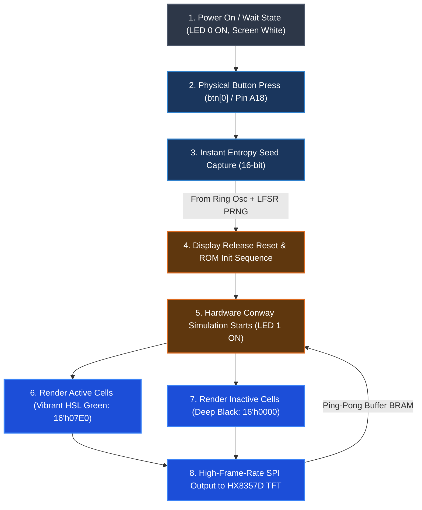

# Fully Integrated FPGA Hardware Random Number Generator & Game of Life System

## Overview and Architecture
This project implements a fully hardware-accelerated embedded system on a single **Digilent CMOD A7-35T FPGA co-processor**. 

The system utilizes a physical ring oscillator to harvest local on-chip entropy, seeds a hardware-based Pseudo-Random Number Generator (PRNG), and instantly initializes Conway's Game of Life. The cellular automaton simulation and the display-driving graphics engine run **entirely** inside the FPGA fabric—rendering high-frame-rate patterns directly onto an **Adafruit 3.5" TFT HX8357D display** via a custom hardware SPI interface.

All logic is implemented in **Verilog**, completely bypassing the need for an external microcontroller (such as the Adafruit Feather M4 Express) or biometric sensor (AS606) in the active simulation path.

---

## 🎨 System Design & Workflow



### Expected Startup Sequence
1. **Idle State**: On power-up, the system enters `S_WAIT`. The TFT display is held in reset (resulting in a blank white screen), and **LED[0]** is turned ON to indicate it is waiting for input.
2. **Seed Generation**: When you press the physical button connected to **btn[0]** (A18), the master FSM debounces the input, captures a highly chaotic 16-bit seed from the physical Ring Oscillator PRNG, and transitions to `S_GOL`.
3. **Display Initialization**: The reset line is released, and the SPI initialization controller (`hx8357d_init.v`) runs a custom hardware ROM sequence to configure the internal registers of the HX8357D display driver.
4. **Active Simulation**: Once initialized, the screen goes black, and Conway's Game of Life simulation begins immediately. **LED[1]** lights up to signal that the co-processor is actively running and updating the display.
5. **Vibrant Graphics**: Active cellular automaton cells are rendered in eye-catching **Green** (`16'h07E0` RGB565) against a deep **Black** (`16'h0000`) background at the full frame rate supported by the physical SPI bus.

---

## 📁 Hardware Verilog Core Modules

All FPGA co-processor source files are located in the [verilog/src/](file:///c:/Users/DarkMidget/Desktop/temp/PRNG_V2/verilog/src) directory:

- **[fpga_main.v](file:///c:/Users/DarkMidget/Desktop/temp/PRNG_V2/verilog/src/fpga_main.v)**: The master FSM and top-level module. Manages workflow states (`S_WAIT`, `S_GOL`), debounces `btn[0]`, handles co-processor reset routing, and drives the diagnostic status LEDs.
- **[ring_osc.v](file:///c:/Users/DarkMidget/Desktop/temp/PRNG_V2/verilog/src/ring_osc.v)**: The primary entropy source. Combines physical ring oscillators with a non-linear LFSR-based PRNG to generate highly chaotic 16-bit seeding values.
- **[hx8357d_controller.v](file:///c:/Users/DarkMidget/Desktop/temp/PRNG_V2/verilog/src/hx8357d_controller.v)**: The display and rendering coordinator. Orchestrates hardware display resets, coordinates command/data SPI packet dispatch, updates framebuffers, renders active cells in RGB565 Green vs Black, and triggers Conway simulation steps at frame boundaries.
- **[hx8357d_init.v](file:///c:/Users/DarkMidget/Desktop/temp/PRNG_V2/verilog/src/hx8357d_init.v)**: Hardware display initializer containing the full register ROM sequence required to bring the 3.5" TFT display out of sleep mode.
- **[game_of_life.v](file:///c:/Users/DarkMidget/Desktop/temp/PRNG_V2/verilog/src/game_of_life.v)**: The Conway's Game of Life execution engine. Features physical cell neighborhood mapping and toroidal wrap-around cell update rules.
- **[bram_framebuffer.v](file:///c:/Users/DarkMidget/Desktop/temp/PRNG_V2/verilog/src/bram_framebuffer.v)**: Reusable dual-port FPGA Block RAM ping-pong buffer module holding active grid frames for the 320x480 resolution display.
- **[spi_master.v](file:///c:/Users/DarkMidget/Desktop/temp/PRNG_V2/verilog/src/spi_master.v)**: Universal high-speed hardware SPI communication master.

---

## 🔌 Pin Mapping and Connection Guide

Ensure the Adafruit 3.5" TFT display and your trigger button are connected directly to the CMOD A7 board as mapped in the unified constraints file `CMODA7_Constrain.xdc`:

### Board Basics and Inputs
| Port Name | FPGA Pin | Physical DIP Pin | Description |
|---|---|---|---|
| `clk` | **L17** | Board Oscillator | 12 MHz Onboard Master Clock |
| `btn[0]` | **A18** | Push Button Input | Active-high debounced button to trigger seed capture |
| `led[0]` | **A17** | Onboard LED 0 | Status: ON during `S_WAIT` (waiting for button) |
| `led[1]` | **C16** | Onboard LED 1 | Status: ON during `S_GOL` (simulation running) |

### HX8357D Display SPI Interface
| Port Name | FPGA Pin | Physical DIP Pin | Display Connector Pin | Description |
|---|---|---|---|---|
| `tft_cs` | **M3** | DIP Pin 1 | **CS** | SPI Chip Select (Active Low) |
| `tft_dc` | **L3** | DIP Pin 2 | **D/C** | Data / Command Selection |
| `tft_rst` | **A16** | DIP Pin 3 | **RST** | Physical Screen Hardware Reset |
| `tft_sck` | **K3** | DIP Pin 4 | **SCK** | SPI Serial Clock |
| `tft_mosi` | **C15** | DIP Pin 5 | **MOSI** | SPI Master Out Slave In |
| `3.3V` | **3.3V** | Pin 3.3V | **VCC** | Power Supply |
| `GND` | **GND** | GND Pin | **GND** | Common System Ground |

---

## 🚀 Setup & Deployment Instructions

### Prerequisites
- **Xilinx Vivado ML Edition** (2022.2 or newer) installed and added to your system `PATH`.
- Connected Digilent CMOD A7-35T FPGA over USB.
- Digilent board files installed in Vivado.

### Deployment in One Command
To build the verilog co-processor, compile the bitstream, and program the FPGA flash persistently, run the following automated PowerShell script:
```powershell
.\verilog\scripts\deployment\run_program.ps1
```
Or use the direct project synthesis deployment tool:
```powershell
.\scripts\build_and_deploy.bat
```

For advanced CLI options or troubleshooting, see the [verilog/QUICK_START.md](file:///c:/Users/DarkMidget/Desktop/temp/PRNG_V2/verilog/QUICK_START.md) guide.
