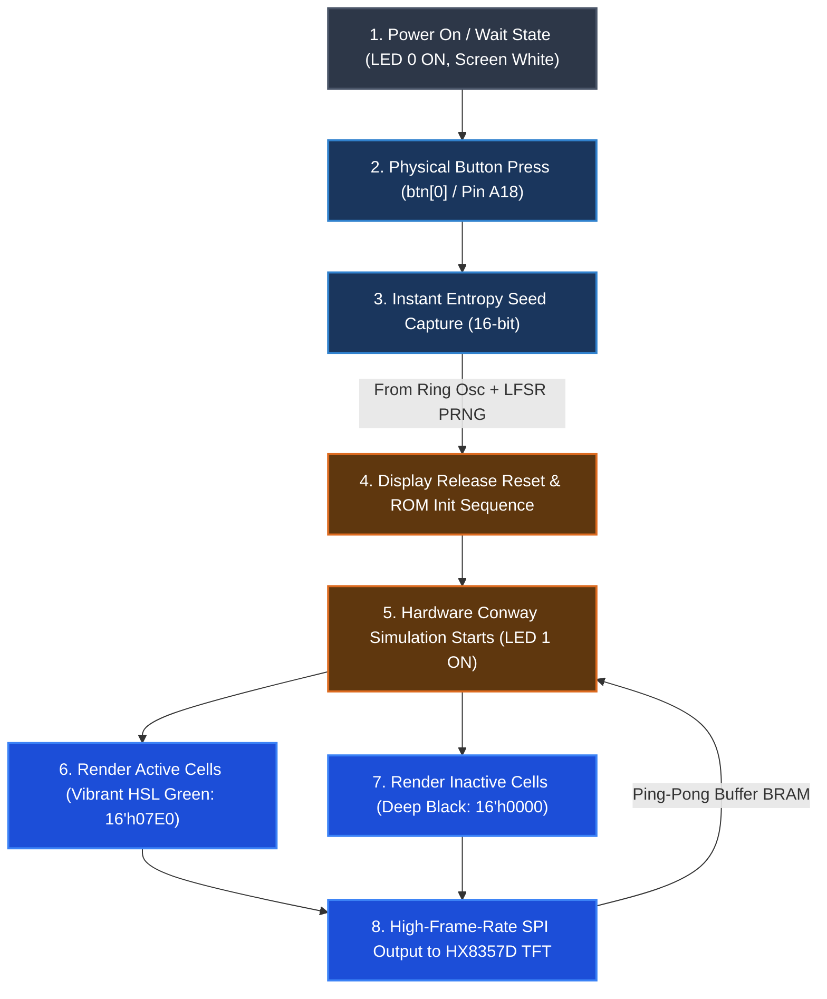

# Fully Integrated FPGA Hardware Random Number Generator & Game of Life System

## Overview and Architecture
This project implements a fully hardware-accelerated embedded system on a single **Digilent CMOD A7-35T FPGA co-processor**. 

The system utilizes a physical ring oscillator to harvest local on-chip entropy, seeds a hardware-based Pseudo-Random Number Generator (PRNG), and instantly initializes Conway's Game of Life. The cellular automaton simulation and the display-driving graphics engine run **entirely** inside the FPGA fabric—rendering high-frame-rate patterns directly onto an **Adafruit 3.5" TFT HX8357D display** via a custom hardware SPI interface.

All logic is implemented in **Verilog**, completely bypassing the need for an external microcontroller (such as the Adafruit Feather M4 Express) or biometric sensor (AS606) in the active simulation path.

---

## 🎨 System Design & Workflow



### 🧬 Verilog Module Architecture & Internal Execution Flow

The system runs entirely in the FPGA fabric, orchestrating state machines, entropy harvesting, and high-frame-rate pixel rendering. Below is a detailed flowchart of the **Verilog Module Architecture & Data/Signal Flow** inside the CMOD A7:

```mermaid
graph TB
    subgraph Master ["Top-Level System: fpga_main.v"]
        clk_in["System Clock (12 MHz)"]
        btn_in["Trigger Button (btn[0])"]
        
        subgraph FSM ["Master FSM States"]
            S_WAIT["S_WAIT - Idle, waiting for button"]
            S_SCAN["S_SCAN - Fingerprint scan active"]
            S_GOL["S_GOL - Active Conway simulation"]
            
            S_WAIT -->|btn_pressed| S_SCAN
            S_SCAN -->|scan_done| S_GOL
        end

        subgraph Entropy ["Entropy & Seed Generation"]
            osc["ring_osc.v - Ring Oscillators + LFSR"]
            scanner["as608_controller.v - AS608 UART Driver"]
            mixer["XOR Mixer - prng_val XOR template_data"]
            
            osc -->|16-bit chaotic val| mixer
            scanner -->|fingerprint template| mixer
            mixer -->|captured_seed| S_GOL
        end
    end

    subgraph GraphicSub ["Display & Logic Subsystem: hx8357d_controller.v"]
        subgraph DisplayReset ["TFT HW Reset SM"]
            R_IDLE["RESET_IDLE - Pull RST Low"]
            R_LOW["RESET_LOW - Hold RST Low 10ms"]
            R_WAIT["RESET_WAIT - Wait 120ms"]
            R_DONE["RESET_DONE - HW Reset Finished"]
            
            R_IDLE --> R_LOW --> R_WAIT --> R_DONE
        end

        subgraph DisplayInit ["Display Initializer"]
            init_rom["hx8357d_init.v - Register ROM Config Sequence"]
        end
        
        R_DONE -->|init_start| init_rom
        
        subgraph RenderEngine ["Rendering & Game of Life FSM"]
            gol["game_of_life.v - Conway CA Core"]
            draw_sm["Pixel Stream FSM - RAMWR Cmd + RGB565"]
            
            subgraph Framebuffers ["Ping-Pong Block RAM Framebuffers"]
                bram_a["bram_framebuffer.v (BRAM A)"]
                bram_b["bram_framebuffer.v (BRAM B)"]
            end
            
            buf_sel_mux["gol_buf_sel Multiplexer"]
            
            gol -->|write next gen| buf_sel_mux
            buf_sel_mux -->|BRAM A / B| Framebuffers
            Framebuffers -->|read current gen| draw_sm
        end
        
        init_rom -->|init_done| RenderEngine
        draw_sm -->|trigger next gen| gol
        gol -->|gen_done| draw_sm
    end

    subgraph Transmit ["Physical Transmitter"]
        spi["spi_master.v - High-speed SPI Master"]
    end

    %% External Interface Wiring
    btn_in -.->|A18 Pin| S_WAIT
    scanner <-->|UART TX/RX (H1/A15)| ext_as608["AS608 Scanner"]
    init_rom -->|SPI data/start| spi
    draw_sm -->|SPI data/cmd/start| spi
    
    spi -->|tft_sck / tft_mosi| ext_tft["Adafruit 3.5 TFT Screen"]
    draw_sm -->|tft_cs / tft_dc| ext_tft
    DisplayReset -->|tft_rst| ext_tft
    
    classDef main fill:#1e1e2e,stroke:#cdd6f4,stroke-width:2px,color:#cdd6f4;
    classDef sub fill:#11111b,stroke:#a6adc8,stroke-width:2px,color:#a6adc8;
    classDef hardware fill:#313244,stroke:#f5c2e7,stroke-width:2px,color:#f5c2e7;
    classDef state fill:#45475a,stroke:#89b4fa,stroke-width:2px,color:#89b4fa;
    classDef ext fill:#181825,stroke:#a6e3a1,stroke-width:2px,color:#a6e3a1;

    class Master,GraphicSub,Transmit main;
    class FSM,DisplayReset,RenderEngine,Entropy sub;
    class osc,scanner,gol,draw_sm,init_rom,bram_a,bram_b,spi hardware;
    class S_WAIT,S_SCAN,S_GOL,R_IDLE,R_LOW,R_WAIT,R_DONE state;
    class ext_as608,ext_tft ext;
```

### Expected Startup Sequence

1. **Idle State**: On power-up, the system enters `S_WAIT`. The TFT display is held in reset (resulting in a blank white screen), and **LED[0]** is turned ON to indicate it is waiting for input.
2. **Seed Generation**: When you press the physical button connected to **btn[0]** (A18), the master FSM debounces the input, captures a highly chaotic 16-bit seed from the physical Ring Oscillator PRNG, and transitions to `S_GOL`.
3. **Display Initialization**: The reset line is released, and the SPI initialization controller (`hx8357d_init.v`) runs a custom hardware ROM sequence to configure the internal registers of the HX8357D display driver.
4. **Active Simulation**: Once initialized, the screen goes black, and Conway's Game of Life simulation begins immediately. **LED[1]** lights up to signal that the co-processor is actively running and updating the display.
5. **Vibrant Graphics**: Active cellular automaton cells are rendered in eye-catching **Green** (`16'h07E0` RGB565) against a deep **Black** (`16'h0000`) background at the full frame rate supported by the physical SPI bus.

---

## 📁 Hardware Verilog Core Modules

All FPGA co-processor source files are located in the [src/](file:///c:/Users/DarkMidget/Desktop/temp/PRNG_V2/src) directory:

- **[fpga_main.v](file:///c:/Users/DarkMidget/Desktop/temp/PRNG_V2/src/fpga_main.v)**: The master FSM and top-level module. Manages workflow states (`S_WAIT`, `S_GOL`), debounces `btn[0]`, handles co-processor reset routing, and drives the diagnostic status LEDs.
- **[ring_osc.v](file:///c:/Users/DarkMidget/Desktop/temp/PRNG_V2/src/ring_osc.v)**: The primary entropy source. Combines physical ring oscillators with a non-linear LFSR-based PRNG to generate highly chaotic 16-bit seeding values.
- **[hx8357d_controller.v](file:///c:/Users/DarkMidget/Desktop/temp/PRNG_V2/src/hx8357d_controller.v)**: The display and rendering coordinator. Orchestrates hardware display resets, coordinates command/data SPI packet dispatch, updates framebuffers, renders active cells in RGB565 Green vs Black, and triggers Conway simulation steps at frame boundaries.
- **[hx8357d_init.v](file:///c:/Users/DarkMidget/Desktop/temp/PRNG_V2/src/hx8357d_init.v)**: Hardware display initializer containing the full register ROM sequence required to bring the 3.5" TFT display out of sleep mode.
- **[game_of_life.v](file:///c:/Users/DarkMidget/Desktop/temp/PRNG_V2/src/game_of_life.v)**: The Conway's Game of Life execution engine. Features physical cell neighborhood mapping and toroidal wrap-around cell update rules.
- **[bram_framebuffer.v](file:///c:/Users/DarkMidget/Desktop/temp/PRNG_V2/src/bram_framebuffer.v)**: Reusable dual-port FPGA Block RAM ping-pong buffer module holding active grid frames for the 320x480 resolution display.
- **[spi_master.v](file:///c:/Users/DarkMidget/Desktop/temp/PRNG_V2/src/spi_master.v)**: Universal high-speed hardware SPI communication master.

---

## 🔌 Pin Mapping and Connection Guide

Ensure the Adafruit 3.5" TFT display and your trigger button are connected directly to the CMOD A7 board as mapped in the unified constraints file `CMODA7_Constrain.xdc`:

### Board Basics and Inputs
| Port Name | FPGA Pin | Physical DIP Pin | Description |
|---|---|---|---|
| `clk` | **L17** | Board Oscillator | 12 MHz Onboard Master Clock |
| `btn[0]` | **A18** | Push Button Input | Active-high debounced button to trigger seed capture |
| `led[0]` | **A17** | Onboard LED 0 | Status: ON during `S_WAIT` (waiting for button) |
| `led[1]` | **C16** | Onboard LED 1 | Status: ON during `S_GOL` (simulation running) |

### HX8357D Display SPI Interface
| Port Name | FPGA Pin | Physical DIP Pin | Display Connector Pin | Description |
|---|---|---|---|---|
| `tft_cs` | **M3** | DIP Pin 1 | **CS** | SPI Chip Select (Active Low) |
| `tft_dc` | **L3** | DIP Pin 2 | **D/C** | Data / Command Selection |
| `tft_rst` | **A16** | DIP Pin 3 | **RST** | Physical Screen Hardware Reset |
| `tft_sck` | **K3** | DIP Pin 4 | **SCK** | SPI Serial Clock |
| `tft_mosi` | **C15** | DIP Pin 5 | **MOSI** | SPI Master Out Slave In |
| `3.3V` | **3.3V** | Pin 3.3V | **VCC** | Power Supply |
| `GND` | **GND** | GND Pin | **GND** | Common System Ground |

### AS608 Fingerprint Scanner UART Interface
| Port Name | FPGA Pin | Physical DIP Pin | Scanner Wire/Pin | Description | Direction |
|---|---|---|---|---|---|
| `as608_tx` | **H1** | DIP Pin 6 | **RXD** (Green wire) | UART Output from FPGA to Scanner | Output (FPGA -> Scanner) |
| `as608_rx` | **A15** | DIP Pin 7 | **TXD** (White wire) | UART Input to FPGA (with Pull-Up) | Input (Scanner -> FPGA) |
| `3.3V` | **3.3V** | Pin 3.3V | **VCC** (Red wire) | Power Supply (3.3V - 5V compatible) | Input Power |
| `GND` | **GND** | GND Pin | **GND** (Black wire) | Ground Pin | Common Ground |

---

## 🗺️ Physical Hardware Wiring Schematic

To wire the Adafruit 3.5" TFT display and the AS608 fingerprint scanner to the Digilent CMOD A7 board, follow this physical connection diagram:

```mermaid
graph LR
    subgraph FPGA_CMOD ["Digilent CMOD A7 FPGA"]
        style FPGA_CMOD fill:#181825,stroke:#cba6f7,stroke-width:3px,color:#cdd6f4
        
        subgraph Pins ["DIP Pins & FPGA Package Pins"]
            P1["DIP Pin 1 (M3) - tft_cs"]
            P2["DIP Pin 2 (L3) - tft_dc"]
            P3["DIP Pin 3 (A16) - tft_rst"]
            P4["DIP Pin 4 (K3) - tft_sck"]
            P5["DIP Pin 5 (C15) - tft_mosi"]
            P6["DIP Pin 6 (H1) - as608_tx"]
            P7["DIP Pin 7 (A15) - as608_rx"]
            
            PGND["GND Pin - Common Ground"]
            P3V3["3.3V Pin - Power Out (3.3V)"]
            PCLK["Onboard L17 - 12 MHz Clock"]
            PBTN["Onboard A18 - btn[0] Trigger"]
        end
    end

    subgraph TFT_SCREEN ["Adafruit 3.5 TFT (HX8357D)"]
        style TFT_SCREEN fill:#1e1e2e,stroke:#89b4fa,stroke-width:3px,color:#cdd6f4
        
        CS["CS - Chip Select"]
        DC["D/C - Data/Command"]
        RST["RST - Hardware Reset"]
        SCK["CLK / SCK - SPI Clock"]
        MOSI["MOSI / SI - Data Input"]
        
        VCC["VCC / 3.3V - Power Input"]
        TGND["GND - Power Ground"]
    end

    subgraph AS608_SCANNER ["AS608 Fingerprint Scanner"]
        style AS608_SCANNER fill:#1e1e2e,stroke:#a6e3a1,stroke-width:3px,color:#cdd6f4
        
        FP_VCC["VCC - Power Input (3.3V-5V)"]
        FP_TX["TX - Transmit (Out)"]
        FP_RX["RX - Receive (In)"]
        FP_GND["GND - Ground"]
    end

    %% TFT Connections
    P1 ===>|SPI Chip Select| CS
    P2 ===>|Command/Data Line| DC
    P3 ===>|TFT HW Reset| RST
    P4 ===>|SPI Clock Bus| SCK
    P5 ===>|SPI MOSI Bus| MOSI
    
    %% AS608 Connections
    P6 ===>|UART Serial (TX -> RX)| FP_RX
    P7 ===>|UART Serial (RX <- TX)| FP_TX

    %% Power and Ground Bus
    P3V3 -.->|3.3V VCC Power| VCC
    P3V3 -.->|3.3V VCC Power| FP_VCC
    
    PGND -.->|System Ground| TGND
    PGND -.->|System Ground| FP_GND

    %% Note styling
    classDef tftLink stroke:#89b4fa,stroke-width:2px;
    classDef uartLink stroke:#a6e3a1,stroke-width:2px;
    classDef pwrLink stroke:#f38ba8,stroke-width:2px,stroke-dasharray: 5 5;
    
    linkStyle 0,1,2,3,4 class tftLink;
    linkStyle 5,6 class uartLink;
    linkStyle 7,8,9,10 class pwrLink;
```

> [!IMPORTANT]
> Keep SPI wire runs as short as possible to avoid signal degradation. Cross-talk on `tft_sck` and `tft_mosi` can cause display artifacts or initialization failures.

---

## 🚀 Setup & Deployment Instructions

### Prerequisites
- **Xilinx Vivado ML Edition** (2022.2 or newer) installed and added to your system `PATH`.
- Connected Digilent CMOD A7-35T FPGA over USB.
- Digilent board files installed in Vivado.

### Deployment in One Command
To build the verilog co-processor, compile the bitstream, and program the FPGA flash persistently, run the following automated PowerShell script:
```powershell
.\scripts\deployment\run_program.ps1
```
Or use the direct project synthesis deployment tool:
```powershell
.\scripts\build_and_deploy.bat
```

For advanced CLI options or troubleshooting, see the [QUICK_START.md](file:///c:/Users/DarkMidget/Desktop/temp/PRNG_V2/QUICK_START.md) guide.

---

## 📁 Repository Reorganization

The repository has been restructured to prioritize a clean, top-level Verilog codebase for direct FPGA synthesis:
- **Verilog Core**: Located in the root directories:
  - `src/` - Verilog hardware modules (`fpga_main.v`, `ring_osc.v`, etc.).
  - `constraints/` - Pin routing and timing constraints.
  - `testbench/` - Simulation and verification suites.
  - `scripts/` - Automated synthesis, implementation, and JTAG flashing tools.
- **Legacy Files Archive**: All legacy microcontroller (Arduino, ESP32, and PlatformIO) C++ source files, libraries, and configurations have been securely archived in the `_archive/legacy_microcontroller/` folder. No code was deleted.
