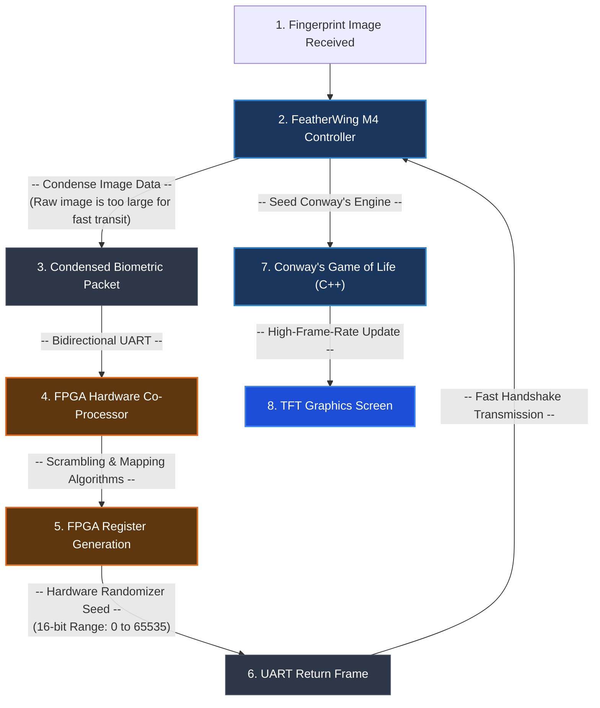
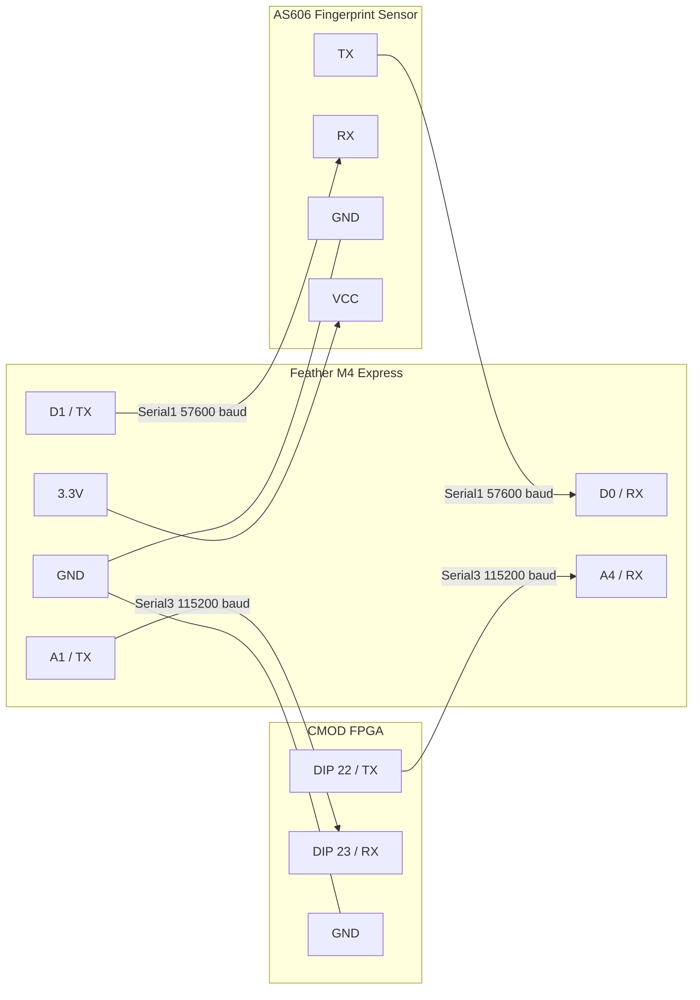

# Biometric-Seeded FPGA Hardware Random Number Generator & Cellular Automaton System

## Overview and Educational Objectives
This project demonstrates a multi-domain embedded system architecture, integrating microcontrollers (Adafruit Feather M4 Express), hardware co-processors (FPGA), biometric sensors (AS606), and graphical displays (HX8357D). 

**The core educational concept:**
We aim to generate high-quality pseudo-random numbers (PRNG) by seeding an FPGA-based randomization engine with real-world, noisy biometric data (a fingerprint scan). The resulting random seed is then used to initialize Conway's Game of Life—a cellular automaton that relies heavily on its initial state to produce chaotic, unpredictable, and visually fascinating evolutionary patterns on a TFT display. 

This project serves as a practical exploration of:
1. **Hardware-Software Co-design:** Offloading complex bit-scrambling and mapping algorithms to an FPGA while handling high-level logic and graphics on a microcontroller.
2. **Entropy and Randomness:** Extracting entropy from biometric sensors and testing the randomness of generated sequences against NIST SP 800-22 standards.
3. **Asynchronous Communication:** Managing inter-device communication using bidirectional UART handshakes.

---

## System Architecture & Code Flow



---

## Hardware Wiring and Connections

Proper hardware connections and shared grounds are critical for reliable UART communication between devices operating at high baud rates.

### Wiring Diagram


### Baud Rates Overview
- **USB Debug:** 115200 baud
- **Fingerprint Sensor (Serial1):** 57600 baud
- **FPGA Link (Serial3):** 115200 baud

---

## Setup & Replication Instructions

To replicate this project, you need to set up the environments for both the Microcontroller (PlatformIO) and the FPGA (Xilinx Vivado). All paths referenced are relative to the project root, meaning there are no hardcoded absolute paths to worry about.

### 1. Feather M4 Firmware
Ensure you have [PlatformIO](https://platformio.org/) installed (via VS Code or CLI).

To build and upload the firmware to the Feather M4:
```bash
# Build the project
platformio run -e feather_m4

# Upload the project to the board
platformio run -e feather_m4 -t upload
```
Alternatively, use the provided PowerShell script (Windows):
```powershell
.\scripts\build.ps1
```

### 2. FPGA (Verilog) Setup
To build and deploy the Verilog hardware logic to the FPGA:
1. Ensure **Xilinx Vivado** is installed and its bin directory is added to your system `PATH`.
2. Connect your FPGA board via USB.
3. Use the provided batch script to synthesize, implement, and deploy:
```cmd
.\scripts\build_and_deploy.bat
```
If the bitstream is already generated and you only want to flash the FPGA, use the deployment script:
```powershell
.\verilog\scripts\deployment\run_program.ps1
```
> **Note:** For more details on configuring the Verilog project or writing tests, see `verilog/README.md`.

---

## Expected Startup Flow & Runtime Commands

Once programmed, use a USB serial monitor (115200 baud) to interact with the system.

### Startup Sequence
1. **Display Initialization:** The TFT screen clears and readies the Conway grid.
2. **FPGA Diagnostic:** The Feather tests the FPGA UART link with a 12-byte loopback pattern.
3. **Sensor Handshake:** The system connects to the AS606 fingerprint sensor.
4. **Biometric Input:** The startup fingerprint scan waits until a valid fingerprint is processed.
5. **Hardware Seed Generation:** The biometric data is sent to the FPGA, which scrambles it and returns a numeric seed. **If the FPGA fails to return a valid numeric seed, the firmware halts (no fallback seeds are used).**
6. **Simulation Starts:** The Game of Life begins with the FPGA-generated seed.

### Available Serial Commands
- `D` : Prints system connectivity status.
- `T` : Runs the FPGA UART loopback diagnostic.
- `F` : Triggers a new fingerprint scan and FPGA seed handoff.
- `R` : Resets Conway's Game of Life with a new random seed.
- `S` : Prints current Game of Life simulation status.

---

## Data Analysis & Randomness Results

Extracting pure randomness is difficult. To verify the entropy of our FPGA logic, the project includes a suite of randomness testing tools (based on the NIST SP 800-22 test suite).

### Running the Python Tests
Ensure Python is installed, activate the virtual environment, and run the analysis scripts:
```powershell
# Activate the virtual environment
.\venv\Scripts\Activate.ps1

# Navigate to the Python scripts directory
cd "data analysis\pythonscripts"

# Run the comprehensive test suite against the collected FPGA data
python randomness_analyzer.py

# Generate visualization plots
python plot_analysis.py
```
*(You can pass a custom CSV file to `randomness_analyzer.py` as an argument if you collect new data).*

### Current Results & Analysis
Testing 311,579 samples (approx. 4.98 million bits) generated the following results:
```text
======================================================================
 TRNG TEST RESULTS - 311,579 samples / 4,985,264 bits
======================================================================
PASS √  Monobit Frequency          p = 0.878968  (93 ms)
PASS √  Block Frequency            p = 0.149790  (12 ms)
PASS √  Runs                       p = 0.329322  (17 ms)
FAIL X  Longest Run                p = 0.000000  (1004 ms)
FAIL X  Spectral (FFT)             p = 0.000000  (2383 ms)
PASS √  Non-overlapping Tmpl       p = 0.037933  (352041 ms)
PASS √  Approximate Entropy        p = 0.592671  (56416 ms)
PASS √  Serial                     p = 0.329772  (55262 ms)
PASS √  Cumulative Sums            p = 0.927777  (4457 ms)
PASS √  Random Excursions          p = 0.265228  (460 ms)
PASS √  Linear Complexity          p = 0.769665  (228642 ms)
----------------------------------------------------------------------
9/11 tests passed
======================================================================

Shannon entropy (16-bit): 15.7573 / 16.0
Min-entropy (conservative): 5.9167 bits/symbol
```

### Analysis of the Results
- **Successes:** Passing 9 out of 11 tests (including Approximate Entropy, Monobit, and Runs) demonstrates that the baseline bit-distribution is highly balanced with no obvious short-term predictability. The Shannon entropy (15.75 / 16.0) indicates excellent bit-density.
- **Failures:** The `Longest Run` and `Spectral (FFT)` tests failed. 
  - **Spectral (FFT) Failure** implies the existence of periodic features or repeating frequency artifacts within the bitstream. This is common in hardware shift registers (LFSR/FLSR) that haven't been adequately masked.
  - **Longest Run Failure** implies that strings of consecutive 1s or 0s deviate from what is expected of true randomness, often caused by hardware biases or resonance in the scrambling logic.

---

## Suggested Improvements & Future Work

To evolve this project and fix the identified shortcomings, the following areas are prime for future development:

1. **Implement Cryptographic Whitening (FPGA/Software):**
   To resolve the `Spectral (FFT)` and `Longest Run` failures, a "whitening" step (such as a von Neumann extractor or passing the output through a lightweight hashing algorithm like SHA-1 or AES-CTR) should be applied to the raw FPGA output to eliminate periodicity and hardware biases.
   
2. **Upgrade to SPI Communication:**
   The current UART link between the M4 and FPGA (115200 baud) is a bottleneck. Upgrading to SPI would allow megabit-level transfer speeds, reducing the latency between the fingerprint scan and Game of Life initialization.
   
3. **Enhanced Biometric Processing:**
   Currently, the system compresses the fingerprint image to fit the UART bandwidth. Exploring ways to transmit higher-fidelity feature maps to the FPGA could provide more unique entropy per scan.
   
4. **Automated CI/CD Pipeline:**
   Develop GitHub Actions to automatically run `platformio build` and simulate the Verilog testbenches on every commit to ensure long-term stability.
